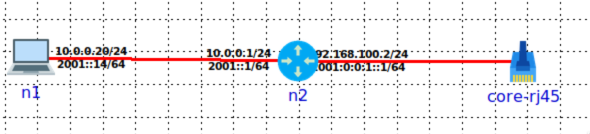
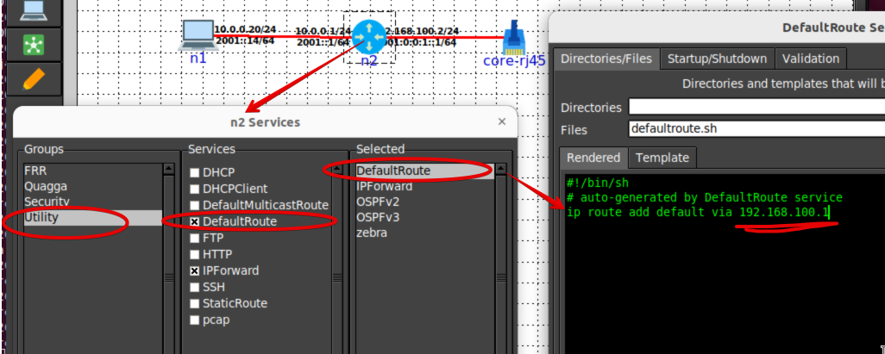

## Ligação RJ45 - Método alternativo

Etapas:

1. Criar link do tipo Veth (vm-internal para core-rj45)

```zsh
sudo ip link add vm-internal type veth peer name core-rj45
```

Antes da criação só existem os interfaces NAT e Host-Only:

```zsh
ifconfig -a
```
```zsh
ens160: flags=4163<UP,BROADCAST,RUNNING,MULTICAST>  mtu 1500
        inet 192.168.130.129  netmask 255.255.255.0  broadcast 192.168.130.255
...
ens256: flags=4163<UP,BROADCAST,RUNNING,MULTICAST>  mtu 1500
        inet 192.168.143.128  netmask 255.255.255.0  broadcast 192.168.143.255
...
lo: flags=73<UP,LOOPBACK,RUNNING>  mtu 65536
        inet 127.0.0.1  netmask 255.0.0.0
...
```

Depois da criação temos o par "veth" ainda por configurar:

```zsh
ifconfig -a
```
```zsh
vm-internal: flags=4098<BROADCAST,MULTICAST>  mtu 1500
        ether 92:53:b3:3e:10:56  txqueuelen 1000  (Ethernet)
        RX packets 0  bytes 0 (0.0 B)
        RX errors 0  dropped 0  overruns 0  frame 0
        TX packets 0  bytes 0 (0.0 B)
        TX errors 0  dropped 0 overruns 0  carrier 0  collisions 0
        
core-rj45: flags=4098<BROADCAST,MULTICAST>  mtu 1500
        ether a2:af:7d:72:a4:15  txqueuelen 1000  (Ethernet)
        RX packets 0  bytes 0 (0.0 B)
        RX errors 0  dropped 0  overruns 0  frame 0
        TX packets 0  bytes 0 (0.0 B)
        TX errors 0  dropped 0 overruns 0  carrier 0  collisions 0
...
```

Uma extremidade vai ser usada do lado da topologia CORE (core-rj45) e a outra do lado da máquina virtual (vm-internal)

```zsh
ip link show
```
```zsh
1: lo: <LOOPBACK,UP,LOWER_UP> ...
2: ens160: <BROADCAST,MULTICAST,UP,LOWER_UP> ....
3: ens256: <BROADCAST,MULTICAST,UP,LOWER_UP> ....
4: core-rj45@vm-internal: <BROADCAST,MULTICAST,M-DOWN> ....
5: vm-internal@core-rj45: <BROADCAST,MULTICAST,M-DOWN> ....
```

2. Configurar novo IPv4 nesse link (extremidade vm-internal)

```zsh
sudo ip address add 192.168.100.1/24 broadcast 192.168.100.255 dev vm-internal 
```

3. Colocar link up

```zsh
sudo ip link set vm-internal up
```


4. Verificar se ficou UP e com o IP certo

```zsh
ifconfig vm-internal
```
```zsh
vm-internal: flags=4099<UP,BROADCAST,MULTICAST>  mtu 1500
        inet 192.168.100.1  netmask 255.255.255.0  broadcast 192.168.100.255
        ether 92:53:b3:3e:10:56  txqueuelen 1000  (Ethernet)
        RX packets 0  bytes 0 (0.0 B)
        RX errors 0  dropped 0  overruns 0  frame 0
        TX packets 0  bytes 0 (0.0 B)
        TX errors 0  dropped 0 overruns 0  carrier 0  collisions 0
```

5. Configurar RJ45 na topologia CORE (extremidade core-rj45)

Duas acções necessárias (conforme ilustrado na figura):
- configurar o elemento RJ45 escolhendo o interface externo "core-rj45"
- configurar a ligação ao elemento RJ45 na mesma rede do vm-interna: 192.168.100.2/24



6. Configurar default routing no CORE para a VM

Configurar, conforme ilustrado na figura, o serviço DefaultRoute no router com ligação ao RJ45, de modo a que o próximo salto seja já o IP da interface "vm-internal" na máquina virtual:



7. Configurar routing da VM para o CORE

```zsh
sudo ip route add 10.0.0.0/8 via 192.168.100.2
```

Tabela de routing:

```zsh
ip route
```

```zsh
default via 192.168.130.2 dev ens160 proto dhcp metric 100 
10.0.0.0/8 via 192.168.100.2 dev vm-internal  
169.254.0.0/16 dev ens160 scope link metric 1000 
192.168.100.0/24 dev vm-internal proto kernel scope link src 192.168.100.1  
192.168.130.0/24 dev ens160 proto kernel scope link src 192.168.130.129 metric 100 
192.168.143.0/24 dev ens256 proto kernel scope link src 192.168.143.128 metric 101 
```

8. Assegurar que a VM está com forwarding IPv4 ativo

```zsh
sudo sysctl -w net.ipv4.conf.all.forwarding=1
sudo sysctl -w net.ipv4.conf.default.forwarding=1
sudo sysctl -w net.ipv6.conf.all.forwarding=1
sudo sysctl -w net.ipv6.conf.default.forwarding=1
```

9. Testes de conectividade

Na VM, ping para o host dentro da topologia CORE:

```zsh
ping 10.0.0.20
```

NOTA: Também deve ser possível conectar como está à máquina nativa, se colocarmos rota também para a 10.0.0.0/8 para dentro da VM.

Explicação:

- Aparenetemente devíamos poder associar o interface RJ45 da topologia CORE a um interface da VM já existente. Mas ao fazermos isso, o interface associado deixa de funcionar. Não sei porquê (ainda). Uma teoria é que o NetworkManager do Ubuntu reconfigura os interfaces, mas mesmo desligando o NetworkManager a coisa não funciona na mesma. Provavelmente os interfaces da VM já estão em bridges no seio do virtualizador usado. Mas sempre foi assim e antigamente funcionava bem.

- O que o CORE GUI faz é criar uma bridge linux e associar o interface externo a essa bridge. Logo podemos fazer isso com qualquer interface, incluindo um nosso criado para o efeito que não esteja sob alçada de mais ninguém. Apenas dificulta um pouco a conectividade para fora da VM (global)

## Referências 

- [CORE Documentation - Tutorial 5 -  RJ45 Node](https://coreemu.github.io/core/tutorials/tutorial5.html#running-with-the-grpc-script)
- [CORE Documentation](https://coreemu.github.io/core/index.html)


